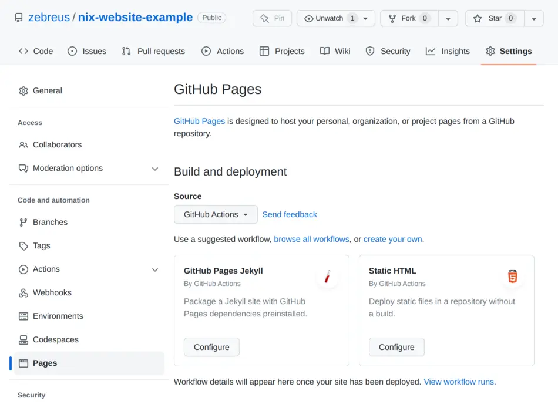

# Static website with github pages and nix flakes

ifdef::env-github[]
https://zebreus.github.io/nix-website-example/[*View me as a website*]
endif::env-github[]
ifndef::env-github[]
++++
<a href="https://github.com/zebreus/nix-website-example">View me on GitHub</a>
++++
endif::env-github[]

Use nix to generate a static site and host it on github pages.

== tldr;

1. Goto the settings of your repo, select the pages tab and set *Source* to *GitHub Actions*.
2. Copy link:default.nix[], link:flake.nix[] and link:.github/workflows/pages.yml[] to your repo.
3. Adjust the `buildPhase` and `installPhase` in default.nix to build your site.
4. Commit and push to github.

Your site is available at https://your-github-username.github.io/your-repo-name/ after the `Deploy to Pages` action is done (~1 min).

== Detailed instructions

=== Building with nix

First you need a nix derivation that builds the root of your page. In this example we will look at the derivation for building this page:

[source,nix]
.default.nix
----
include::default.nix[]
----

In it we define the dependencies required to build the page, in this case only `asciidoctor`. In the `buildPhase` we execute some commands to generate our html files. In the `installPhase` we copy the files we need to the output at `$out`. `$out` will be the root of our page.

We also have a nix flake to serve as an entrypoint to out script. It also contains small a script to start a local preview of your page. 

.flake.nix
[%collapsible]
====
[source,nix]
----
include::flake.nix[]
----
====

You can copy these files to your repository and adjust the build process in default.nix for your project. You don't need to modify flake.nix.

By executing `nix run .` you can start a local preview of your page on `localhost:8000`.

=== Deploying to github pages

To setup deployment to github pages you need to go to your repository settings, then to the pages tab, and set *Source* to *GitHub Actions*.

.It should look similar to this

That should be all the configuration you need to do in github. The last step is to add a github action to deploy your website on every push to master or main.

To do that you just need to copy the following file to your repo:

[source,nix]
..github/workflows/pages.yml
----
include::.github/workflows/pages.yml[]
----

When you commit and push your files the action should be triggered and deploy to github pages. You can now view your page at https://your-github-username.github.io/your-repo-name/

== EXTRA: Use your own domain

You can use a custom domain instead of username.github.io. In this example we will configure github pages to work with the base of your naked domain and the `www` subdomain. To prepare your domain you need to add the following DNS records to your domain:

[NOTE]
====
You need to replace *your-github-username* in the CNAME record with your actual username.
====

[NOTE]
====
The TXT record is required to verify your domain ownership with github. You can get the values you need to set here in your https://github.com/settings/pages_verified_domains/new[github settings].
====

[cols="1,1,1"]
|===
|Type |Host |Value
 
| A
| @
| 185.199.108.153

| A
| @
| 185.199.109.153

| A
| @
| 185.199.110.153

| A
| @
| 185.199.111.153

| AAAA
| @
| 2606:50c0:8000::153

| AAAA
| @
| 2606:50c0:8001::153

| AAAA
| @
| 2606:50c0:8002::153

| AAAA
| @
| 2606:50c0:8003::153

| CNAME
| www
| *your-github-username*.github.io

| TXT
2+| You can get the host and value you need to set here in your https://github.com/settings/pages_verified_domains/new[github settings].
|===

After you set the DNS entries you should first make sure, that your domain is verified with github now. You can go to the https://github.com/settings/pages_verified_domains[page where you got the values for the TXT record] and check the verification status. If it is not verified yet click on the three dots, select *Continue verifying* and then click *Verify* again.

After your domain is verified you can configure it for your repository. Go to the settings of your repo, select the pages tab and set *Custom domain* to your naked domain (like `example.com`). Hit *Save* and wait for the DNS check to succeed. If it fails wait a few minutes and try again, the DNS entries may have not been updated yet. After the check succeeded you need to set the *Custom domain* to the `www` subdomain (like `www.example.com`). Hit save again and wait for the check to succeed. Now you can set the *Custom domain* back to the naked domain hit save one more time and you are done.

[NOTE]
====
We set *Custom domain* multiple times, because github redirects all domains that have been set at some point in the past to the current one.
====